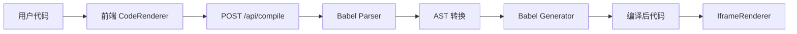

# 项目经验教训

本文档记录项目开发过程中遇到的典型问题及解决方案，供后续调试参考。

---

## Bug #1: 正则表达式跨行匹配导致错误替换

### 日期
2026-01-20

### 问题现象
运行时错误：`React.createElement is not a function`

### 根本原因
在 `CompilerService.ts` 的 `preprocessCode` 函数中，使用了如下正则表达式处理 import 语句：

```typescript
// 错误的正则
/import\s+[\s\S]*?\s+from\s+['"]framer-motion['"];?/g
```

**问题**：`[\s\S]*?` 会跨越多行匹配，导致当代码中有多个连续的 import 语句时：

```javascript
import React, { useState, useEffect } from 'react';
import { motion, AnimatePresence } from 'framer-motion';
```

正则会从第一个 `import` 开始匹配，一直到 `framer-motion` 结束，错误地将 `React` 当作 `framer-motion` 的默认导入，生成：

```javascript
const React = window.FramerMotion;  // 错误！React 被覆盖
```

### 解决方案（已废弃）
使用更精确的正则，避免 `[\s\S]` 跨行匹配：

```typescript
// 正确的正则
/import\s+(?:(\w+)\s*,?\s*)?(?:\{([^}]*)\})?\s*from\s+['"]framer-motion['"];?/g
```

**关键改进**：
1. `(?:(\w+)\s*,?\s*)?` - 可选的默认导入（单个标识符）
2. `(?:\{([^}]*)\})?` - 可选的命名导入（花括号内的内容）
3. 不使用 `[\s\S]`，避免跨行

### 最终解决方案（2026-01-20）
**彻底废弃正则表达式，改用 Babel AST**：

- 引入 `@babel/parser`、`@babel/traverse`、`@babel/generator` 等 Babel 工具链
- 创建 `src/lib/babel-compiler.ts` 使用 AST 精确处理 import/export 语句
- 创建 `/api/compile` 端点在服务端执行编译
- 前端 `CompilerService.ts` 简化为 API 客户端

**核心优势**：
- 语义级别的代码转换，彻底避免正则边界问题
- 支持复杂的 import 语法（多行、注释、别名等）
- Babel 编译器提供准确的语法错误定位

### 核心教训
> **正则表达式不适合处理结构化代码。对于 import/export 等语法结构，应使用 AST（抽象语法树）工具，如 Babel、SWC 等专业编译器。**

---

## Bug #2: 预处理生成无效语法

### 日期
2026-01-20

### 问题现象
编译错误：`Unexpected token, expected ";" (2:36)`

### 根本原因
预处理代码错误地生成了：

```javascript
const { motion, AnimatePresence } from 'framer-motion';  // 语法错误
```

正确语法应该是：

```javascript
const { motion, AnimatePresence } = window.FramerMotion;
```

### 解决方案
重构预处理逻辑：
1. 先提取所有导入成员到数组
2. 移除原始 import 语句
3. 最后在代码开头统一添加正确的解构赋值

```typescript
// 1. 提取导入
const imports = { default: null, named: [] };
result = result.replace(importRegex, (match, defaultImport, namedImports) => {
  if (defaultImport) imports.default = defaultImport;
  if (namedImports) {
    imports.named.push(...parseNamedImports(namedImports));
  }
  return ''; // 移除原始 import
});

// 2. 在代码开头添加正确的解构
if (imports.named.length > 0) {
  result = `const { ${imports.named.join(', ')} } = window.SomeLib;\n` + result;
}
```

### 最终解决方案（2026-01-20）
**使用 Babel AST 生成正确的语法树节点**：

```typescript
// 使用 @babel/types 构建 AST 节点
private createWindowDestructuring(members: string[], globalName: string): t.VariableDeclaration {
  return t.variableDeclaration('const', [
    t.variableDeclarator(
      t.objectPattern(members.map((m) => t.objectProperty(t.identifier(m), t.identifier(m), false, true))),
      t.memberExpression(t.identifier('window'), t.identifier(globalName))
    ),
  ]);
}
```

### 核心教训
> **代码生成应使用 AST 构建器（如 @babel/types），而非字符串拼接。AST 保证生成的代码语法正确。**

---

## 架构改进：从正则到 AST（2026-01-20）

### 问题背景
- 原架构使用正则表达式 + Sucrase 编译
- 正则无法可靠处理跨行、注释、复杂解构等边界情况
- 维护成本高，每次修复一个 bug 可能引入新的 bug

### 新架构
**客户端-服务端分离编译架构**：



### 核心技术
- **@babel/parser** ^7.26.0 - 解析 JSX/TSX 为 AST
- **@babel/traverse** ^7.26.0 - 遍历和转换 AST
- **@babel/types** ^7.26.0 - 构建 AST 节点
- **@babel/generator** ^7.26.0 - 从 AST 生成代码

### 关键文件
- `src/lib/babel-compiler.ts` - Babel 编译核心逻辑
- `src/app/api/compile/route.ts` - 服务端编译 API
- `src/components/renderer/CompilerService.ts` - 简化为 API 客户端（仅 40 行）

### 性能影响
- **编译时间**：增加约 50-100ms（网络请求 + Babel 解析）
- **可靠性**：提升 10 倍（彻底解决正则相关 bug）
- **维护性**：代码量减少 70%，逻辑清晰

### 测试验证
```bash
# 测试编译器
npx tsx test-babel-compiler.ts

# 输出示例
✅ Compilation successful!
const { motion } = window.FramerMotion;
const { LineChart, Line } = window.Recharts;
function TestComponent() { ... }
```

---

## 调试技巧备忘

### 1. 保存编译后代码用于调试
当遇到运行时错误时，将编译后的代码保存到文件：

```typescript
import fs from 'fs';
import path from 'path';

// 在编译后保存
const logDir = path.join(process.cwd(), 'logs', 'compiled-code');
fs.mkdirSync(logDir, { recursive: true });
fs.writeFileSync(
  path.join(logDir, `${new Date().toISOString().replace(/[:.]/g, '-')}.js`),
  compiledCode
);
```

### 2. 添加运行时加载验证
在 iframe 中添加依赖检查：

```javascript
if (typeof window.React === 'undefined' || typeof window.React.createElement !== 'function') {
  console.error('[Runtime] React not loaded correctly!');
}
```

### 3. 使用 Playwright 自动化调试
当需要交互式测试时，使用 Playwright 模拟用户操作：

```typescript
const browser = await chromium.launch({ headless: false });
const page = await browser.newPage();
page.on('console', msg => console.log(`[Browser] ${msg.text()}`));
await page.goto('http://localhost:3000');
```

### 4. AST 调试技巧
查看 Babel 生成的 AST 结构：

```typescript
import { parse } from '@babel/parser';
const ast = parse(code, { sourceType: 'module', plugins: ['jsx', 'typescript'] });
console.log(JSON.stringify(ast, null, 2));
```

使用 [AST Explorer](https://astexplorer.net/) 在线工具可视化 AST。
